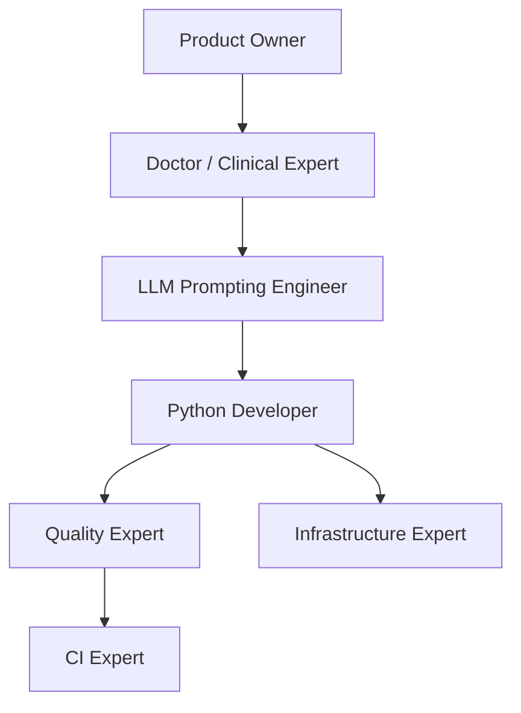

# Oncoflow AI Agent Guidelines (`AGENTS.md`)

Welcome to the **Oncoflow** development guidelines for AI agents and coding assistants. This document acts as a "README for machines," providing explicit instructions, operational workflows, and domain expert guidelines to build, test, and maintain the Oncoflow platform safely and efficiently.

---

## 📖 Project Overview & Tech Stack

Oncoflow is a secure, open-source, local-first web application designed for oncology clinical professionals (surgeons, doctors, and oncologists) in France. It leverages local Large Language Models (LLMs) and Retrieval-Augmented Generation (RAG) to:
1. **Analyze Patient Records (MTDs)** to extract clinical and administrative info.
2. **Detect Missing Records** to flag incomplete patient files.
3. **Assess Case Urgency** and recommend an optimized MDT/RCP meeting order.
4. **Integrate Scientific Reference guidelines** (TNCD - Thésaurus National de Cancérologie Digestive) to support clinical decision-making.

### Technical Stack & Key Dependencies
- **Core Runtime**: Python `>=3.13` (strictly enforced in `pyproject.toml`; note that legacy `HOW-TO-CONTRIBUTE.md` may mention `3.11.X`, but `pyproject.toml` is the source of truth).
- **Frontend Dashboard**: Streamlit (`streamlit>=1.57.0`, `streamlit-pdf-viewer`, `streamlit-authenticator`).
- **Orchestration**: LangChain (`langchain-core`, `langchain-community`, `langchain-experimental`, `langchain-ollama`).
- **Vector Search Databases**: 
  - Milvus (`pymilvus==2.6.14`, `langchain-milvus==0.3.3`) for main retrieval.
  - Chroma (`chromadb>=1.5.9`, `langchain-chroma`) as alternative.
- **Relational / Document DB**: MongoDB (`pymongo>=4.17.0`, `langchain-mongodb`) for caching and storing patient records meta-information.
- **Document Parsers**: Docling (`docling-core`), MuPDF (`pymupdf`), Ollama OCR (`ollama-ocr`), OpenParse (`openparse`).
- **Local LLM Engine**: Ollama (`mistral-nemo` for reasoning, `granite3.2-vision` for OCR, `nomic-embed-text` / `all-MiniLM-L6-v2` for embeddings).

---

## 🛠️ Executable Commands & Development Workflows

All development operations must follow these exact shell commands. Standard prefix-hooks automatically optimize performance.

| Operation | Command | Purpose |
| :--- | :--- | :--- |
| **Verify Tooling** | `rtk --version` | Verify the Rust Token Killer utility |
| **Environment Check** | `rtk gain` | View token analytics and dev operation savings |
| **Docker Compose** | `docker compose -f docker/compose/milvus-standalone-docker-compose.yml up -d` | Spin up local Milvus Standalone database |
| **Install Dependencies**| `uv pip install -e .` or `uv sync` | Fast dependency resolution using `uv` |
| **Run Linter** | `ruff check src/` | Lint python files with Ruff rules |
| **Format Code** | `ruff format src/` | Format python files according to PEP8 |
| **Run Unit Tests** | `pytest src/application/agent/tests/` | Run test suite for the LangChain agent |
| **Run App Dev Mode** | `uv run streamlit run app-ui.py` | Start Streamlit UI server locally |

---

## 🛡️ Critical Boundaries & Rules (MUST NEVER VIOLATE)

> [!CAUTION] **Patient Data Privacy (Local-Only Execution)**
> Oncoflow deals with highly confidential medical data. **Never use public APIs or remote cloud services** (like OpenAI, Anthropic, or external embedding servers) for parsing or model invocation. All operations must run locally via local Docker services (Milvus, MongoDB) or local Ollama instances to guarantee hospital data compliance.

> [!WARNING] **Dependency Synchronization**
> Always respect `pyproject.toml` dependencies. Do not use ad-hoc versions. Use `uv.lock` to pin dependencies.

> [!IMPORTANT] **Model Identifier Check**
> Do not assume model identifiers are available or guess their configurations. Always fall back to `AppConfig.llm` parsed environment configurations.

---

## 🤝 Multi-Agent Expert Skills

Oncoflow defines custom agent skills in the `skills/` folder to capture specific domain expertise. These skills are automatically discoverable by Google Antigravity SDK agents.



### 1. 🐍 Python Developer
- **Domain**: Advanced python constructs, LangChain API usage, database connection pools, parser performance.
- **Location**: [python-developer/SKILL.md](file:///home/guillaume/git/oncoflow/skills/python-developer/SKILL.md)

### 2. ✍️ LLM Prompting Engineer
- **Domain**: System instructions, structured outputs, validation, retry strategies, and LLM temperature behaviors.
- **Location**: [llm-prompting-engineer/SKILL.md](file:///home/guillaume/git/oncoflow/skills/llm-prompting-engineer/SKILL.md)

### 3. 📋 Product Owner
- **Domain**: Oncology Multidisciplinary Team Meeting (RCP/MDT) specifications, patient status tracking, and case triage metrics.
- **Location**: [product-owner/SKILL.md](file:///home/guillaume/git/oncoflow/skills/product-owner/SKILL.md)

### 4. 🩺 Doctor (Clinical Expert)
- **Domain**: Medical nomenclature, oncology staging relevance, TNCD standard checks, clinical correlation validity.
- **Location**: [doctor/SKILL.md](file:///home/guillaume/git/oncoflow/skills/doctor/SKILL.md)

### 5. 🚀 CI Expert
- **Domain**: Automated pipelines, code syntax checking, dependency validation, test orchestration.
- **Location**: [ci-expert/SKILL.md](file:///home/guillaume/git/oncoflow/skills/ci-expert/SKILL.md)

### 6. 🌐 Infrastructure Expert
- **Domain**: Standalone Docker services, database connections (Milvus, MongoDB, ChromaPersistent), hardware acceleration, and memory footprint constraints.
- **Location**: [infrastructure-expert/SKILL.md](file:///home/guillaume/git/oncoflow/skills/infrastructure-expert/SKILL.md)

### 7. 🎯 Quality Expert
- **Domain**: Unit test coverage, exception safety, logging consistency, and edge-case validation.
- **Location**: [quality-expert/SKILL.md](file:///home/guillaume/git/oncoflow/skills/quality-expert/SKILL.md)

---

## ⚡ MCP Server & Context7 Integration

To provide real-time, version-specific package documentation during development, Upstash Context7 MCP is integrated.

### 1. Global Editor Configuration
Add the Context7 server definition to your editor/client configuration (e.g. Cursor, Claude Desktop, or Windsurf config files):

```json
{
  "mcpServers": {
    "context7": {
      "command": "npx",
      "args": [
        "-y",
        "@upstash/context7-mcp"
      ]
    }
  }
}
```

### 2. Usage Instructions
Trigger the context server in your prompts by suffixing:
> "How do I optimize a Milvus similarity search in LangChain? use context7"

This injects the exact, up-to-date documentation directly into the context window, eliminating hallucinations and stale API usage.

### 3. Adding Skills via Context7 CLI
Context7 provides a CLI wizard to search, install, and generate modular skills for your agent using official docs:
- **Search existing skills**: `npx ctx7 skills search <keywords>`
- **Install specialized community skills**: `npx ctx7 skills install <owner/repo>`
- **Launch the Skill Wizard to generate a skill**: `npx ctx7 skills generate`
