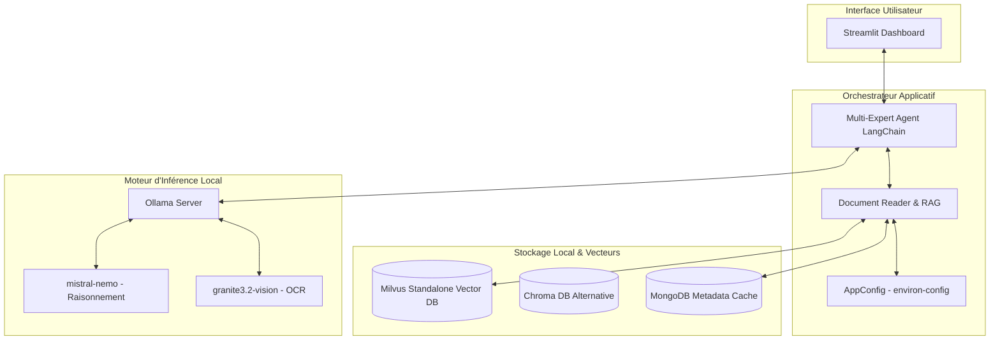

# ✨ Oncoflow — L'IA locale au service de la cancérologie digestive

<p align="left">
  <a href="https://github.com/oncoflow/oncoflow/actions/workflows/ci.yml"></a>
  <a href="application/tests"></a>
  <a href="application/tests"></a>
  <a href="https://github.com/astral-sh/ruff"></a>
  <a href="https://github.com/aquasecurity/trivy"></a>
</p>

<p align="left">
  <a href="https://www.python.org/"></a>
  <a href="https://github.com/astral-sh/uv"></a>
  <a href="https://streamlit.io/"></a>
  <a href="https://www.langchain.com/"></a>
  <a href="https://milvus.io/"></a>
  <a href="https://www.mongodb.com/"></a>
</p>

<p align="left">
  <a href="#-souveraineté--sécurité-locale"></a>
  <a href="LICENSE"></a>
  <a href="https://discord.gg/C2RPhyn9x8"></a>
</p>

**Oncoflow** est une solution logicielle innovante, gratuite, open-source et **100% locale**, conçue spécifiquement pour les professionnels francophones de la santé (chirurgiens, oncologues, gastro-entérologues). Elle exploite les capacités des modèles de langage locaux (LLM) et du RAG (Retrieval-Augmented Generation) pour simplifier et optimiser la préparation et le déroulement des **Réunions de Concertation Pluridisciplinaire (RCP)** en oncologie digestive.

---

## 🗺️ Vision Clinique vs Solution Technique

Pour répondre au mieux aux besoins de chacun de nos utilisateurs, la documentation d'Oncoflow est scindée en deux grands espaces :

```
                        ┌──────────────────────────────┐
                        │      PORTAIL ONCOFLOW        │
                        └──────────────┬───────────────┘
                                       │
                ┌──────────────────────┴──────────────────────┐
                ▼                                             ▼
      🩺 ESPACE CLINICIENS                          💻 ESPACE TECHNIQUE
 ━━━━━━━━━━━━━━━━━━━━━━━━━━━━━                 ━━━━━━━━━━━━━━━━━━━━━━━━━━━━━
  • Bénéfices cliniques & RCP                   • Clean Onion Architecture
  • Détection d'anomalies                       • Milvus & MongoDB Docker
  • Aide au triage des dossiers                 • Modèles Ollama locaux
  • Référentiel TNCD                            • Variables d'environnement
                │                                             │
      [Lire le Guide Clinique]                      [Lire le Guide Technique]
      (docs/guide_clinique.md)                      (docs/guide_technique.md)
```

---

## 🩺 1. Espace Cliniciens (Professionnels de Santé)

Vous êtes chirurgien, oncologue, gastro-entérologue ou secrétaire médical de RCP ? Oncoflow a été pensé pour réduire votre charge mentale administrative en automatisant la synthèse de vos dossiers patients tout en fiabilisant les processus de prise en charge.

### Ses atouts cliniques majeurs :
1. **Synthèse de dossier instantanée** : Extraction et structuration des caractéristiques tumorales (classification TNM, type histologique, biomarqueurs).
2. **Alerte de pièces manquantes (Missing Records)** : L'IA détecte si un examen obligatoire (compte-rendu d'anatomopathologie, examen biologique ou d'imagerie) fait défaut avant la réunion, évitant ainsi de reporter le dossier.
3. **Optimisation de l'ordre de passage** : Triage automatisé priorisant les cas cliniques complexes nécessitant le plus de débats pluridisciplinaires.
4. **Intégration du TNCD** : Confrontation directe des critères du patient avec les fiches de recommandations cliniques officielles du **Thésaurus National de Cancérologie Digestive (TNCD)**.

### 🛡️ Souveraineté & Sécurité Locale
> [!IMPORTANT] **Respect absolu du Secret Médical (RGPD)**
> Oncoflow fonctionne **intégralement hors-ligne (local-first)**. Vos documents et données médicales ne transitent jamais sur internet ou sur des serveurs cloud tiers (zéro connexion avec OpenAI, Google, etc.). Tout le calcul s'effectue localement au sein de l'infrastructure sécurisée de l'hôpital.

👉 **[Consulter le Guide d'Utilisation Clinique Complet](docs/guide_clinique.md)**

---

## 💻 2. Espace Technique (Développeurs & Admins IT)

Vous êtes ingénieur de recherche, développeur ou administrateur système hospitalier ? Oncoflow est conçu selon des standards rigoureux en Python `>=3.13` avec une architecture propre facilitant l'auditabilité et la maintenance.

### ⚙️ L'Architecture RAG Multi-Agents locale :


```mermaid
flowchart TB
    subgraph UI [Interface Utilisateur]
        Streamlit[Streamlit Dashboard]
    end

    subgraph APP [Orchestrateur Applicatif]
        Agent[Multi-Expert Agent LangChain]
        Reader[Document Reader & RAG]
        Config[AppConfig - environ-config]
    end

    subgraph DB [Stockage Local & Vecteurs]
        Milvus[(Milvus Standalone Vector DB)]
        Chroma[(Chroma DB Alternative)]
        Mongo[(MongoDB Metadata Cache)]
    end

    subgraph AI [Moteur d'Inférence Local]
        Ollama[Ollama Server]
        Mistral[mistral-nemo - Raisonnement]
        Granite[granite3.2-vision - OCR]
    end

    Streamlit <--> Agent
    Agent <--> Reader
    Reader <--> Config
    Reader <--> Milvus
    Reader <--> Mongo
    Agent <--> Ollama
    Ollama <--> Mistral
    Ollama <--> Granite
```

### Stack Technique Principale :
* **Frontend Dashboard** : Streamlit (`streamlit>=1.57.0`, `streamlit-pdf-viewer`, `streamlit-authenticator`)
* **Orchestration RAG** : LangChain (`langchain-core`, `langchain-community`, `langchain-ollama`)
* **Indexation Vectorielle** : Milvus standalone (`pymilvus==2.6.14`, `langchain-milvus==0.3.3`) ou ChromaDB
* **Base de données de Cache & Métadonnées** : MongoDB (`pymongo>=4.17.0`)
* **Parsers de Documents** : Docling, MuPDF, OpenParse & Ollama OCR

### 🔐 Authentification & Sécurité :
L'application intègre un système d'authentification local sécurisé via `streamlit-authenticator` :
* **Fichier de configuration** : Les utilisateurs et leurs informations sont gérés localement dans le fichier `application/auth_config.yaml`.
* **Identifiants par défaut** :
  * Nom d'utilisateur : `admin`
  * Mot de passe : `admin`
* **Gestion des utilisateurs** : Les informations des utilisateurs et leurs mots de passe hachés en Bcrypt sont gérés dans le fichier YAML. Un script d'ajout d'utilisateurs interactif est disponible sous `application/scratch/add_user.py`. Vous pouvez le lancer depuis le dossier `application/` pour ajouter ou modifier des utilisateurs de façon transparente :
  ```bash
  uv run python scratch/add_user.py
  ```

👉 **[Découvrir la Fiche Technique Complète & Variables](docs/guide_technique.md)**
👉 **[Accéder au Guide de Contribution & Setup local](HOW-TO-CONTRIBUTE.md)**

---

## 👥 Discord & Communauté

Oncoflow est un projet open-source communautaire. Pour proposer de nouvelles fonctionnalités, poser vos questions techniques ou nous aider à intégrer d'autres thésaurus médicaux, rejoignez notre serveur d'échange :

💬 **[Lien d'accès au Discord Officiel Oncoflow](https://discord.gg/C2RPhyn9x8)**

---

## 📄 Licence

Ce projet est distribué sous licence libre (voir le fichier [LICENSE](LICENSE) pour plus de détails).
