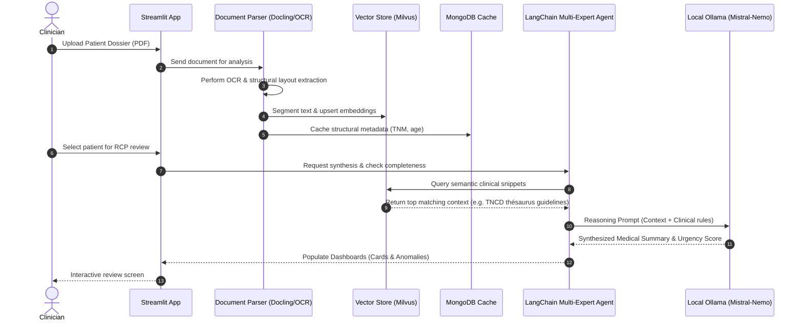

# 💻 Oncoflow — Technical Reference Guide

This document provides a comprehensive technical overview of the **Oncoflow** platform. It describes the clean onion architecture, infrastructure dependencies, data flows, and full environment variable configurations.

---

## 🏗️ Clean Onion Architecture

The backend of Oncoflow is built in Python (strictly requiring `>=3.13`) using Clean Architecture principles to keep the business rules independent of database systems, frameworks, and user interfaces.

```
                  ┌─────────────────────────────────────┐
                  │              UI layer               │
                  │        (Streamlit, app-ui.py)       │
                  │                  │                  │
                  │  ┌───────────────▼───────────────┐  │
                  │  │       Application layer       │  │
                  │  │  (Agents, Use cases, RAG)     │  │
                  │  │               │               │  │
                  │  │  ┌────────────▼────────────┐  │  │
                  │  │  │       Domain layer      │  │  │
                  │  │  │   (Entities, Interfaces)│  │  │
                  │  │  └─────────────────────────┘  │  │
                  │  └───────────────────────────────┘  │
                  │                  ▲                  │
                  │                  │                  │
                  │         Infrastructure            │
                  │     (Milvus, MongoDB, Parsers)    │
                  └─────────────────────────────────────┘
```

### Module breakdown under `application/src/`:
* **`domain/`**: Contains the core patient structures, validation boundaries, and abstract interface contracts. Zero external framework dependencies.
* **`application/`**:
  * **`agent/`**: The core multi-expert LangChain agent coordinator.
  * **`reader.py`**: The RAG (Retrieval-Augmented Generation) ingestion and matching pipeline.
  * **`config.py`**: Reads environmental configurations and exposes them statically via the `AppConfig` class.
* **`infrastructure/`**:
  * **`vectorial/`**: Database wrappers for Milvus and Chroma vector databases.
  * **`database.py`**: Repositories handling MongoDB integrations for cache and MTD/RCP history.
  * **`parsers/`**: Ingestion layer leveraging **Docling**, **MuPDF**, **OpenParse**, or **Ollama OCR** for reading patient folders.
* **`ui/`**: Streamlit pages (`patient_mdt_oncologic/` cards, data sheets, uploading, and active agent visualizations).

---

## 🗄️ Database & Storage Layer

Oncoflow employs dual storage paradigms to ensure ultra-low latency and scalable local lookups:

### 1. Vector Search Engines (Similarity Store)
* **Milvus (Production Default)**: Run as a local docker container (`milvus-standalone`). Used to index dense embeddings of patient records and TNCD clinical thésaurus guidelines for similarity semantic queries. Uses `pymilvus==2.6.14` and `langchain-milvus==0.3.3`.
* **Chroma (Development Alternative)**: Running in either a local persistent client or a lightweight http server. Convenient for isolated local development without full docker footprints.

### 2. Relational / Document Store
* **MongoDB**: Standard persistent storage database. It maintains:
  * Extracted structural metadata of patient files (such as age, TNM classifications, markers).
  * Meeting schedules (RCP/MDT order configurations).
  * System cache of parsed documents to prevent redundant processing.

---

## 🤖 Local AI & Reasoning Engine

All machine learning models run strictly inside the local network boundary via **Ollama**.

* **Reasoning Model**: `mistral-nemo` (12B parameters, highly accurate on French medical terminology) or `llama3.1` variations.
* **OCR/Vision Model**: `granite3.2-vision` (used by Ollama OCR to analyze complex scanned paper diagrams or handwritten hospital documents).
* **Embeddings**: `nomic-embed-text` or `all-MiniLM-L6-v2` (for converting text chunks into 384/768-dimensional float vectors).

---

## ⚙️ Comprehensive Environment Variables

Oncoflow is highly customizable through environment variables parsed transparently by `environ-config` under `AppConfig` (prefixed with `APP_`).

| Variable Name | Type | Default Value | Description |
| :--- | :--- | :--- | :--- |
| **`APP_LOGS_LEVEL`** | `str` | `INFO` | Standard application logging level (`DEBUG`, `INFO`, `WARNING`, `ERROR`). |
| **`APP_LOGS_TYPE`** | `str` | `text` | Logging structure format (`text` or `json`). |
| **`APP_LOGS_LANGCHAINDEBUG`** | `bool`| `False` | Toggle to enable internal LangChain verbose debugging output. |
| **`APP_LLM_TYPE`** | `str` | `Ollama` | LLM service engine style. |
| **`APP_LLM_URL`** | `str` | `http://127.0.0.1`| Base endpoint of the local inference server. |
| **`APP_LLM_PORT`** | `str` | `11434` | Inference server port. |
| **`APP_LLM_MODELS`** | `str` | `gemma4:e4b` | Model identifier for generation/reasoning. |
| **`APP_LLM_OCRMODELS`** | `str` | `granite3.2-vision` | Model identifier for vision-based OCR extraction. |
| **`APP_LLM_TEMP`** | `float`| `1.0` | Sampling temperature for the model. |
| **`APP_LLM_EMBEDDINGS`**| `str` | `embeddinggemma` | Vector embedding model name. |
| **`APP_DBVEC_TYPE`** | `str` | `milvus` | Production Vector store backend (`milvus` or `chroma`). |
| **`APP_DBVEC_COLLECTION`**| `str` | `oncoflowDocs` | Base collection name for vector indices. |
| **`APP_MILVUS_TOKEN`** | `str` | `root:Milvus` | Authentication credentials for Milvus DB. |
| **`APP_MILVUS_DATABASE`**| `str` | `oncowflow` | Milvus target database name. |
| **`APP_MILVUS_PORT`** | `str` | `19530` | Milvus service port. |
| **`APP_MILVUS_HOST`** | `str` | `localhost` | Hostaddress of Milvus standalone server. |
| **`APP_CHOMA_CLIENT`** | `str` | `HttpClient` | Chroma database connector class (`HttpClient` or `PersistentClient`). |
| **`APP_CHOMA_HOST`** | `str` | `localhost` | Chroma HTTP host address. |
| **`APP_CHOMA_PORT`** | `str` | `8000` | Chroma HTTP service port. |
| **`APP_MONGODB_USER`** | `str` | `root` | Root username for MongoDB service. |
| **`APP_MONGODB_PASSWORD`**| `str` | `root` | Root password for MongoDB service. |
| **`APP_MONGODB_HOST`** | `str` | `127.0.0.1` | Hostaddress of MongoDB server. |
| **`APP_MONGODB_PORT`** | `str` | `27017` | Service port for MongoDB. |
| **`APP_MONGODB_DATABASE`**| `str` | `Oncoflow` | Relational/Document metadata database name. |
| **`APP_MONGODB_VECTORDATABASE`**| `str`| `OncoflowVector`| Alternate vector store database name if MongoDB is configured as vector store. |
| **`APP_RCP_PATH`** | `path` | `ressources/PatientMDTOncologicForm` | Local directory containing patient dossier PDF documents. |
| **`APP_RCP_ADDITIONAL_PATH`**| `path`| `ressources/TNCD` | Local directory containing official TNCD clinical thésaurus guidelines. |
| **`APP_RCP_DOC_TYPE`** | `str` | `docling` | Parsing engine standard used for layout extraction (`docling`, `pypdf`, `pymupdf`). |
| **`APP_RCP_CHUNK_SIZE`** | `int` | `1000` | Length boundary of text chunks during vector ingestion. |
| **`APP_RCP_CHUNK_OVERLAP`**| `int` | `150` | Length of consecutive text overlap between sliding chunks. |
| **`APP_RCP_MANUAL_QUERY`**| `bool`| `False` | Run CLI interactive prompt loop instead of Streamlit GUI. |
| **`APP_RCP_DISPLAY_TYPE`**| `str` | `mongodb` | Underlying display mechanism style. |

---

## ⚡ Execution Ingestion Flow (RAG Sequence)

The diagram below details how patient medical records are parsed, embedded, and queried in conformity with French oncology guidelines.



---

## 🛠️ Developer Warnings & Optimizations

* **Warning Suppressions**: Real-time hospital displays run without console logs pollution. The core `app-ui.py` automatically handles the filtering of standard deprecation logs:
  - Suppresses Hugging Face Transformers module path imports warnings.
  - Suppresses PyMilvus ORM-style warning hooks (`Index.to_dict is deprecated`).
  - Suppresses streamlit-pdf-viewer experimental annotation warnings.
* **Environment variables checks**: Run `uv run python3 app.py -e` inside the `application/` folder to check validation settings of all environment variables currently loaded on your host machine.
